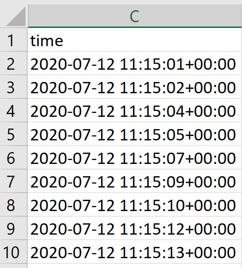

# Strava Cycling EDA

This Python repository covers the Exploratory Data Analysis (EDA) for 3 bike rides recorded by Strava. I've chosen to analyze only 3 rides so that the differences among them can be explored without worrying about the other 250+ rides of data.

EDA will cover the following areas:

- Accessing the GPS data from Strava's website
- What a GPX is
- Loading .gpx files into a Pandas dataframe
- Common enrichments needed to enhance the usefulness of the base data
- Data quality concerns
- Ensuring data privacy when sharing with others

A brief data dictionary will be provided as well.

## 1. Accessing the Ride Data

In order to access the ride data from Strava, do the following:

1. Navigate to [Strava's website](https://www.strava.com/) and sign in to your account
2. After logging in, Strava will bring you to your "dashboard". In the upper left is a box which contains a count of your activities. This count is also a link to the list of your activities, so click on it   
3. Find a ride that interests you and click on it. If you want to share the data for that ride, it is recommended to choose a ride that doesn't start or end at your current residence (or any previous). 
4. Underneath the overview there is a box with an ellipsis icon (...). Click that and then hit "Export GPX" to download the data for that ride   
5. Move the .gpx file to the directory you'll be working in

## 2. What is a GPX File?

Great, we just downloaded a .gpx file, but what exactly is it? GPX is short for GPS Exchange Format, but before diving into a conceptual discussion, let us take a look at the inside of a .gpx file to gain some intuition. An abbreviated version of the file is shown below with a few hierarchical annotations:   *View inside the .gpx file*

First we see that the file is broken up into an XML tree structure with a `<gpx>` node as the parent of all other data. Besides some metadata sprinkled throughout (trip start time, trip name, etc.), the file is made up of a **Track** node. A **Track** contains at least one **Track Segment** which in turn contains multiple **Track Points**. Each **Track Point** contains the chronologically ordered "story" of my bike ride. It gives us GPS coordinates (latitude and longitude) as well as the elevation and timestamp of when we were at that point. Although I do not have a health tracking device to synchronize with Strava, I imagine that other data channels like heart rate or blood-oxygen content might appear here. 

So we have an idea about how the ride data is modeled in an XML tree, but what does it physically represent? The following cartoon describes the physical activity:   *Physical activities represent by a .gpx file*

In general, a .gpx file can contain *routes* and *tracks*. A route is an unordered collection of *waypoints*--a pair of GPS coordinates at a minimum--and represents a coarse-grain path from start to destination. A route example is the GPS route plotted by Google Maps to navigate your car to a certain trailhead. There might be multiple waypoint sequences that could be routes you might take to the destination, but typically your navigation app will select the best (i.e. shortest) route for you. You can always miss a turn in which case the projected route updates to handle this change. 

A track is chronologically ordered set of track points. Unlike the route which contains possible waypoints, a track represents the precise history of points in space and time where you were. It is a fine-grain path that records how you travelled. For example, once you arrived at a trailhead, you might unpack your bike and turn on Strava before riding off onto the trail loop. If you were to lose GPS signal by riding under an overpass, your track would continue, but would be then recorded as at least 2 different *track segments*. A track has at least 1 track segment where each segment contains a collection of continuously recorded track points [[1]](https://en.wikipedia.org/wiki/GPS_Exchange_Format).

### How Strava Records GPX Files
It is worth noting that Strava .gpx files seem to only ever contain 1 track segment. Strava has a auto-pause feature, which stops recording data when you aren't moving. This is useful for not only conserving phone battery but ultimately representing your bike ride's moving time and average speed more accurately. According to the definition of a *track segement*, we would expect multiple segments whenever this happened in the trip. Perhaps, Strava combines these multiple segments into just 1 after uploading.

## 3. Loading GPX Data into Pandas
Since the .gpx format is essentially XML, we could use a python XML library to parse the nodes, but luckily there is a simple alternative purpose built for this called `gpxpy`. To install the package, use `pip install gpxpy` or your enviroment's relevant package manager. The reference for the package can be found [here](https://github.com/tkrajina/gpxpy), though it is recommended to use a `with` statement as a context manager when reading in the .gpx file. You can find the completed process of loading .gpx data and saving .csv data via Pandas in Notebook #0.

## 4. Planning an EDA Project
Exploratory Data Analysis sometimes feels like going into an unknown forest to explore. At some times it feels exciting, but in others, EDA can be scary--often inducing data vertigo. Although our dataset from step #3 is only 6 columns and ~8,300 rows, many others can be a hundred (or more!) columns and hundreds of thousands rows (and certainly more!). I like to imagine that my unknown forest is made up of many trees from across my various files. Each tree is as tall is as its rows and as healthy-looking as its data quality--free of missing leaves or outlier burls. The 6 columns in the dataset represent 6 unique species of trees in our data forest. Each species has its own characteristics such as data type, units, and its relationship to other species. A entangled analogy, perhaps, but stay with me! Each data forest represents an exciting adventure and it makes the arduous "Understanding" phase more enjoyable to plan with such analogies in mind.

### Data Dictionary:

In lucky cases, you are given a data dictionary. This serves as a field guide that describes the purpose of each species/column within the data forest. In our case, Strava does not publish a data dictionary for its .gpx downloads, however, each column seems is easy to understand. We'll make our own field guide:

- :evergreen_tree: `track` (*int*) = a locally unique1 ID for a GPX track within a ride's data. _Derived column_
- :evergreen_tree: `segment` (*int*) = a locally unique1 ID for a GPX segment within a GPX track. _Derived column_
- :palm_tree: `time` (*datetime*) = the naive2 timestamp that states when the row was recorded.
- :deciduous_tree: `elevation` (*float*) = the elevation of the user in feet.
- :deciduous_tree: `longitude` (*float*) = the longitude of the user in degrees.
- :deciduous_tree: `latitude` (*float*) = the latitude of the user in degrees

1the number sequence is unique, but starts with 0 for each file regardless of globally how many IDs have been produced

2the timestamp is not recorded with timezone information. Thus is naively is local time. I know it is the Eastern timezone, though

The first two columns are essentially trees we planted in the .csv version of the ride data. They may not be useful in the future, but we can keep them for now to see if there is a difference across many files. 

:white_check_mark: **Tip:** keep track of all explicit questions that arise when looking at the data. These will be the primary search paths you can use during EDA to explore and map your data forest.

:heavy_exclamation_mark: **Warning:** when possible, write down any assumptions you have about the data. These are implicit thoughts about your data so it may not always be easy to catch them. Validating assumptions is critical to shoring up the foundation of any work built upon them.

### Modeling _Time_ in Data:

The data Strava records is meant to model reality. Location for example is estimated using three numbers of finite precision (`elevation`, `latitude`, `longitude`). The _"when"_ of something occurring is modeled by time. We all have a general sense of what time _is_. Time is always increasing and we often count it in days, hours, minutes or seconds. How we record time numerically--and how often--depends on our needs. Let's examine these different needs through the lens of an Electric Vehicle.

#### Time Scales of Interest
- **Years**: a customer needs a new car and decides to lease an electric vehicle at Company X. Marketing and Sales care about this buying cycle in years
- **Months**: the customer needs to know how many months left are in their vehicle's lease
- **Days**: a grocery store wants to know how many days on average the customer takes between shopping trips to better plan its EV charger infrastructure
- **Hours**: the customer wants to know how long their vehicle will take to charge at their home given their current State of Charge and charger power
- **Minutes**: the customer wants to know how many minutes driving to the store will take
- **Seconds**: the customer wants to know how many seconds it takes to get from 0 to 60 MPH before choosing to lease the vehicle
- **Milliseconds**: the customer and vehicle design team care how long the car takes to start and its systems to boot up
- **Microseconds**: past this level, the customer doesn't care since the scale is disconnected from their driving experience. The powertrain design team care about the inverter control loop delay in microseconds since a good control loop will ensure the 0 to 60 MPH eletric motor response meets customer expectations
- **Nanoseconds**: the power module designers for the inverter care about the "reverse recovery time" of the diodes since this contributes to thermal designs and control loop limitations
- **Picoseconds**: representing one trillionth of a second, this time scale is not relevant to the vehicles designers, except to research scientists working on fundamental research questions

#### Time Differences
In the electric vehicle example above, all of the time scales were related to a single entity and time differences are "self-contained". This means that there is no confusion as to when the "start" is. This is not always the case with time, however. A simple example is the flights leaving and departing an airport. Timezones can be easily crossed, so the representation of time matters significantly. You would be surprised to see a flight as taking 0 hours if their systems compared 10:00 AM at the start to 10:00 AM at the end, ignoring timezones. 

If you are trying to run an e-commerce website, then knowing the customers' timezones is important to track busy times on the site. In either the airport of e-commerce examples, setting a common origin for all time measurements is important. Otherwise, the true trends can be masked or distorted by hidden offsets.

#### Discrete vs. Continuous Time Sampling
Regardless of scale and origin, _how often_ we capture data is often a choice made for us. Time is always increasing, and we could try to measure it continuously. This would mean breaking time into infinitesimally small divisions and recording data for each infinitely small slice of time. Not only do we lack clocks this precise, we would need infinite storage to store this information. A **continuous** sampling of time is not feasible, so we must opt for **discrete** points in time. Suppose we are measuring the speed of that electric vehicle. The two types of sampling would look like:   

The continuous red trace of Speed vs. Time shows us there is more detail than captured in the 8 discrete samples. Nonetheless, we must sample and store discrete datapoints. The choice that _do_ have is _how often_ we sample our system to record data. The sampling frequency depends entirely on the time scale we are interested in and the detail of the signals we want to capture. For example, the speed signal of a car might be best described in 1 second intervals (a 1 Hz sampling frequency). If we wanted more detail on the speed signal, we could record it every 1 microsecond (a 1 MHz sampling frequency). The issue is that we may gain some detail, but our car's speed doesn't change so quickly and we would use a lot of storage to record similar speeds. On the other extreme, recording the car's speed once per year captures almost no useful information and the annual speed could come from any trip. Choosing a sampling frequency is the subject of the [Nyquist Sampling Frequency](https://en.wikipedia.org/wiki/Nyquist_frequency). 

Unless you are designing the data capture process--perhaps you are making a Raspberry Pi weatherstation--you may be stuck with the sampling rate of the data provider. We will need to check what that is for Strava data.

#### Synchronous vs. Asynchronous Time Samples
Once we agree on a time scale of interest and an origin/start, our data model must decide _when_ it should record the physical state of the system. Of course we must sample discrete points in time, but we are not required or guaranteed to have a consistent sampling frequency. If we sample in synch with a single sampling frequency, our data points are **synchronous** and our data is a **time series**. 

If the data is only recorded when certain events occur, our data points are **asynchronous** and is an **event series**. Take the following graph of a car's headlamp state for example:   

The light blue line represents the continuous state of headlamps. We cannot take infinite samples, so we will have to record the data discretely. We could create a discrete timeseries, as represented by the blue dots. By doing so, we would store 8 rows of data to represent the 3 different states. Because the state changes so slowly, 5 out of the 8 rows contain redundant information. Instead of synchronous samples, we could record when a state change happens. This event-based approach is asynchronous since the state changes there is not a finite frequency able to record exactly when each change occurs. Instead we could store the initial state of the headlamps and only add 2 rows representing each change and when it happened. 

Although an event series for the headlamp may store less redudant data, other signals for a car may require synchronous samples (e.g. speed). Even if the data is collected as a time series, it may be better to analyze certain events as an event series. For most reasonable sampling frequencies, turning a time series --> event series is relatively easy. The error you introduce from this transformation is that you is bounded between  where $T_s$ is the time between samples. This error represents that you don't know exactly when the event occurred, just that it occurred between two successive samples.

Constructing a time series from an event series is often trickier. For example, if we only recorded a vehicle's speed when the headlamp status changed, we might have long periods of time between samples. Trying to guess what happened to speed could be almost as bad as sampling the speed annually. 

Event series are perfectly useful, however. An E-commerce website typically has no need to record every mouse movement (unless evaluating a new UX design). Recording the customer's screen state every second could generate a lot of useless data. Instead, recording what website a user came from, and the sequence of events from log-in to cart to purchase is a lot more useful.

#### Strava's Model of Time
We can see from the first couple of rows of the `time` column, that the timestamps are recorded with date (year, month, day) and time information as granular as seconds:  

The time intervals between rows seem to either be 1 second or 2 seconds. So even if our data are discrete points in time, they are not quite synchronous. This is something we will need to fix since we want to deal with a time series.

The timescale of seconds is perfectly reasonably, though. As a bike rider with human limits, any motions I make can be described with enough detail at this timescale. The "origin" or timezone for the timestamps are naive and otherwise unclear. As the person generating the data, I can say that it is created in the Eastern timezone. Since I will only be comparing my trips, these naive timestamps are fine. It may be necessary to adjust for daylight savings in the future though. The question of when "night" begins/ends is related to this information, but perhaps we can find these historical sunsets/rises with an API.