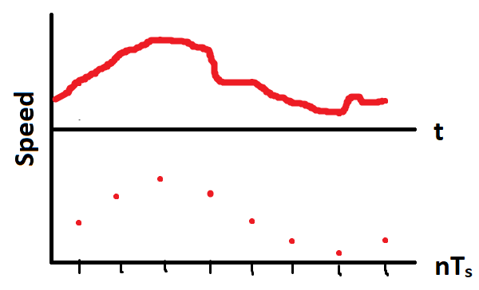

### Modeling _Time_ in Data:

The data Strava records is meant to model reality. Location for example is estimated using three numbers of finite precision (`elevation`, `latitude`, `longitude`). The _"when"_ of something occurring is modeled by time. How we record time is dependent on the following specifications:

- **Origin/Reference Point**: when comparing sequences of time, it is useful to refer to the same starting point. Time zones are the easiest way to reference a local time (e.g. 10:30 AM) across the globe.
- **Time Scale**: the granularity of recorded time. This is based on the needs of the analysis or design.
- **Discretization**: time is a continuous quantity, but we cannot record infinite samples so we must record a discrete point in time.
- **Synchronicity**: when you capture discrete points in time, we can do this synchronous to a sampling frequency (time series data) or asynchronously when events occur (event series data).

#### Time Scales of Interest
We all have a general sense of what time _is_. Time is always increasing and we often count it in days, hours, minutes or seconds. How we record time numerically--and how often--depends on our needs. Let's examine these different needs through the lens of an Electric Vehicle.

- **Years**: a customer needs a new car and decides to lease an electric vehicle at Company X. Marketing and Sales care about this buying cycle in years
- **Months**: the customer needs to know how many months left are in their vehicle's lease
- **Days**: a grocery store wants to know how many days on average the customer takes between shopping trips to better plan its EV charger infrastructure
- **Hours**: the customer wants to know how long their vehicle will take to charge at their home given their current State of Charge and charger power
- **Minutes**: the customer wants to know how many minutes driving to the store will take
- **Seconds**: the customer wants to know how many seconds it takes to get from 0 to 60 MPH before choosing to lease the vehicle
- **Milliseconds**: the customer and vehicle design team care how long the car takes to start and its systems to boot up
- **Microseconds**: past this level, the customer doesn't care since the scale is disconnected from their driving experience. The powertrain design team care about the inverter control loop delay in microseconds since a good control loop will ensure the 0 to 60 MPH eletric motor response meets customer expectations
- **Nanoseconds**: the power module designers for the inverter care about the "reverse recovery time" of the diodes since this contributes to thermal designs and control loop limitations
- **Picoseconds**: representing one trillionth of a second, this time scale is not relevant to the vehicles designers, except to research scientists working on fundamental research questions

#### Time Differences
In the electric vehicle example above, all of the time scales were related to a single entity and time differences are "self-contained". This means that there is no confusion as to when the "start" is. This is not always the case with time, however. A simple example is the flights leaving and departing an airport. Timezones can be easily crossed, so the representation of time matters significantly. You would be surprised to see a flight as taking 0 hours if their systems compared 10:00 AM at the start to 10:00 AM at the end, ignoring timezones. 

If you are trying to run an e-commerce website, then knowing the customers' timezones is important to track busy times on the site. In either the airport of e-commerce examples, setting a common origin for all time measurements is important. Otherwise, the true trends can be masked or distorted by hidden offsets.

#### Discrete vs. Continuous Time Sampling
Regardless of scale and origin, _how often_ we capture data is often a choice made for us. Time is always increasing, and we could try to measure it continuously. This would mean breaking time into infinitesimally small divisions and recording data for each infinitely small slice of time. Not only do we lack clocks this precise, we would need infinite storage to store this information. A **continuous** sampling of time is not feasible, so we must opt for **discrete** points in time. Suppose we are measuring the speed of that electric vehicle. The two types of sampling would look like:   

The continuous red trace of Speed vs. Time shows us there is more detail than captured in the 8 discrete samples. Nonetheless, we must sample and store discrete datapoints. The choice that _do_ have is _how often_ we sample our system to record data. The sampling frequency depends entirely on the time scale we are interested in and the detail of the signals we want to capture. For example, the speed signal of a car might be best described in 1 second intervals (a 1 Hz sampling frequency). If we wanted more detail on the speed signal, we could record it every 1 microsecond (a 1 MHz sampling frequency). The issue is that we may gain some detail, but our car's speed doesn't change so quickly and we would use a lot of storage to record similar speeds. On the other extreme, recording the car's speed once per year captures almost no useful information and the annual speed could come from any trip. Choosing a sampling frequency is the subject of the [Nyquist Sampling Frequency](https://en.wikipedia.org/wiki/Nyquist_frequency). 

Unless you are designing the data capture process--perhaps you are making a Raspberry Pi weatherstation--you may be stuck with the sampling rate of the data provider. We will need to check what that is for Strava data.

#### Synchronous vs. Asynchronous Time Samples
Once we agree on a time scale of interest and an origin/start, our data model must decide _when_ it should record the physical state of the system. Of course we must sample discrete points in time, but we are not required or guaranteed to have a consistent sampling frequency. If we sample in synch with a single sampling frequency, our data points are **synchronous** and our data is a **time series**. 

If the data is only recorded when certain events occur, our data points are **asynchronous** and is an **event series**. Take the following graph of a car's headlamp state for example:   

The light blue line represents the continuous state of headlamps. We cannot take infinite samples, so we will have to record the data discretely. We could create a discrete timeseries, as represented by the blue dots. By doing so, we would store 8 rows of data to represent the 3 different states. Because the state changes so slowly, 5 out of the 8 rows contain redundant information. Instead of synchronous samples, we could record when a state change happens. This event-based approach is asynchronous since the state changes there is not a finite frequency able to record exactly when each change occurs. Instead we could store the initial state of the headlamps and only add 2 rows representing each change and when it happened. 

Although an event series for the headlamp may store less redudant data, other signals for a car may require synchronous samples (e.g. speed). Even if the data is collected as a time series, it may be better to analyze certain events as an event series. For most reasonable sampling frequencies, turning a time series --> event series is relatively easy. The error you introduce from this transformation is that you is bounded between  where  is the time between samples. This error represents that you don't know exactly when the event occurred, just that it occurred between two successive samples.

Constructing a time series from an event series is often trickier. For example, if we only recorded a vehicle's speed when the headlamp status changed, we might have long periods of time between samples. Trying to guess what happened to speed could be almost as bad as sampling the speed annually. 

Event series are perfectly useful, however. An E-commerce website typically has no need to record every mouse movement (unless evaluating a new UX design). Recording the customer's screen state every second could generate a lot of useless data. Instead, recording what website a user came from, and the sequence of events from log-in to cart to purchase is a lot more useful.

